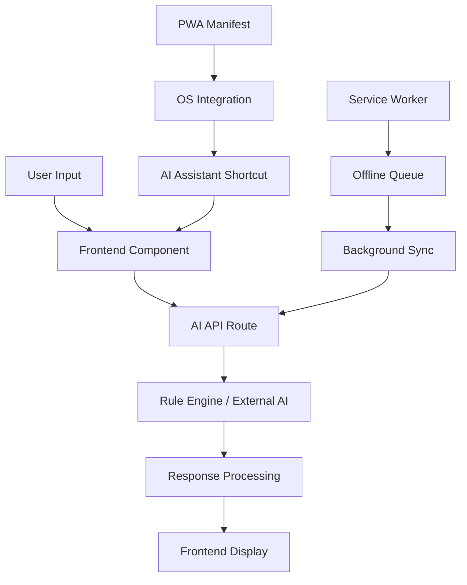

# LifeSync Microservices Architecture

## Overview
LifeSync has been enhanced with a modern microservices foundation that combines PWA capabilities with AI-powered features. This architecture provides a scalable foundation for future service extraction and advanced functionality.

## Current Architecture

### 1. Progressive Web App (PWA) Foundation
- **Service Worker**: Advanced caching with offline support and AI request queueing
- **Manifest**: Rich PWA configuration with AI assistant shortcuts
- **Offline Experience**: Dedicated offline page with feature availability guide
- **Background Sync**: Queue AI requests when offline, process when online

### 2. AI Microservices Foundation

#### AI Categorization Service (`/api/ai/categorize`)
**Purpose**: Smart expense categorization using pattern matching and machine learning
**Features**:
- Rule-based categorization with confidence scoring
- Context-aware suggestions
- Pattern matching for food, transportation, shopping, bills, etc.
- Extensible for external AI service integration (OpenAI, Claude)

**API Contract**:
```typescript
POST /api/ai/categorize
{
  "description": "Uber ride to airport",
  "amount": 45.50,
  "context": { "date": "2025-10-23", "location": "NYC" }
}

Response:
{
  "success": true,
  "category": "Transportation",
  "confidence": 0.85,
  "reasoning": "Contains transportation keywords",
  "suggestions": ["Consider using public transport", "Set transport budget"],
  "timestamp": "2025-10-23T10:30:00Z"
}
```

#### AI Suggestions Service (`/api/ai/suggestions`)
**Purpose**: Generate personalized insights and recommendations
**Features**:
- Expense pattern analysis with spending trends
- Budget optimization suggestions
- Bill splitting recommendations
- Spending behavior insights
- Trend analysis and anomaly detection

**API Contract**:
```typescript
POST /api/ai/suggestions
{
  "type": "expense_analysis",
  "data": { expenses: [...], timeframe: "month" }
}

Response:
{
  "success": true,
  "suggestions": [
    {
      "type": "insight",
      "title": "Top Spending Category",
      "message": "You spend most on Food & Dining ($450.00)",
      "action": "set_category_budget",
      "priority": "medium"
    }
  ],
  "metadata": { "generated_at": "...", "model": "rule_based" }
}
```

### 3. Frontend AI Integration Components

#### CategorySuggestion Component
**Location**: `src/components/ai/AIIntegration.tsx`
**Purpose**: Real-time expense categorization in forms
**Features**:
- Automatic category suggestion based on description and amount
- Confidence display and reasoning
- One-click category acceptance
- Loading states and error handling

#### AIInsights Widget
**Purpose**: Dashboard widget for personalized insights
**Features**:
- Expandable insights panel
- Priority-based suggestion display
- Action buttons for suggestion implementation
- Refresh capability for updated insights

### 4. Data Flow Architecture



## Service Extraction Roadmap

### Phase 1: Current State (✅ Completed)
- ✅ AI API routes as microservice foundation
- ✅ PWA infrastructure with offline support
- ✅ AI integration components
- ✅ Service worker with AI request queueing

### Phase 2: Service Separation (Next Steps)
- **AI Service Extraction**: Move AI routes to separate Node.js service
- **API Gateway**: Implement request routing and authentication
- **Service Discovery**: Container orchestration with Docker
- **Database Separation**: Dedicated AI service database

### Phase 3: Advanced Microservices
- **Event-Driven Architecture**: Service communication via events
- **Scalable AI**: Integration with external AI services (OpenAI, Claude)
- **Real-time Updates**: WebSocket connections for live insights
- **Advanced Analytics**: Dedicated analytics microservice

## Technical Implementation Details

### Type Safety
All AI services use proper TypeScript interfaces:
```typescript
interface CategoryResult {
  category: string
  confidence: number
  reason: string
  suggestions?: string[]
}

interface Suggestion {
  type: string
  title: string
  message: string
  action: string
  priority: 'high' | 'medium' | 'low'
}
```

### Error Handling
- Graceful degradation when AI services are unavailable
- Offline queue for AI requests
- User-friendly error messages
- Fallback to manual categorization

### Performance Optimizations
- Debounced AI requests for real-time suggestions
- Cached results for common patterns
- Service worker caching for offline availability
- Lazy loading of AI components

## Service Configuration

### Environment Variables
```env
# AI Service Configuration
AI_SERVICE_ENABLED=true
AI_EXTERNAL_API_KEY=sk-...
AI_CONFIDENCE_THRESHOLD=0.7
AI_CACHE_TTL=3600

# Microservice URLs (when extracted)
AI_SERVICE_URL=http://ai-service:3001
ANALYTICS_SERVICE_URL=http://analytics:3002
```

### Docker Composition (Future)
```yaml
version: '3.8'
services:
  lifesync-app:
    build: .
    ports:
      - "3000:3000"
    environment:
      - AI_SERVICE_URL=http://ai-service:3001
    
  ai-service:
    build: ./services/ai
    ports:
      - "3001:3001"
    environment:
      - DATABASE_URL=postgresql://...
      - OPENAI_API_KEY=sk-...
    
  redis:
    image: redis:alpine
    ports:
      - "6379:6379"
```

## Monitoring and Observability

### AI Service Metrics
- Categorization accuracy rates
- Response times and throughput
- Confidence score distributions
- User acceptance rates for suggestions

### Performance Monitoring
- API endpoint response times
- Service worker cache hit rates
- Offline queue processing stats
- PWA engagement metrics

## Security Considerations

### AI Data Privacy
- No sensitive data sent to external AI services
- Local processing for basic categorization
- User consent for advanced AI features
- Data encryption in transit and at rest

### API Security
- Rate limiting on AI endpoints
- Authentication tokens for service communication
- Input validation and sanitization
- CORS configuration for service calls

## Future Enhancements

### Natural Language Processing
- Voice-to-text expense entry
- Natural language todo parsing
- Smart bill splitting with conversation analysis
- Automated receipt text extraction

### Advanced AI Features
- Predictive budgeting with trend analysis
- Anomaly detection for unusual spending
- Personalized financial recommendations
- Integration with banking APIs for auto-categorization

### Multi-tenant Architecture
- User-specific AI models
- Collaborative filtering for shared expenses
- Team budgeting and analytics
- Enterprise-grade security and compliance

## Development Guidelines

### Adding New AI Services
1. Create API route in `/api/ai/[service-name]/route.ts`
2. Define TypeScript interfaces for requests/responses
3. Implement proper error handling and validation
4. Add frontend integration component
5. Update service worker for offline support
6. Add monitoring and logging

### Testing Strategy
- Unit tests for AI categorization logic
- Integration tests for API endpoints
- E2E tests for complete user workflows
- Performance tests for AI response times
- Offline functionality testing

This architecture provides a solid foundation for scaling LifeSync into a full microservices application while maintaining excellent user experience and performance.